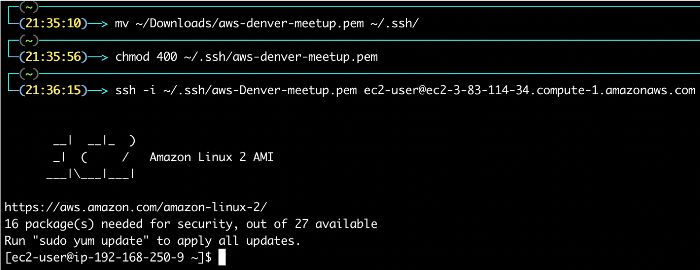
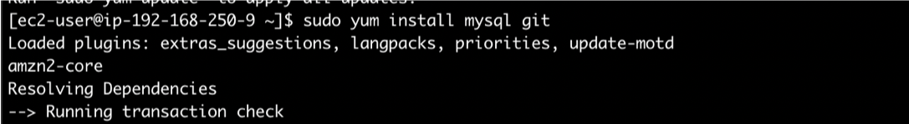
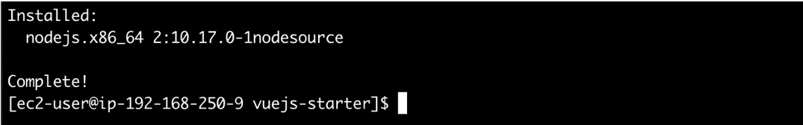
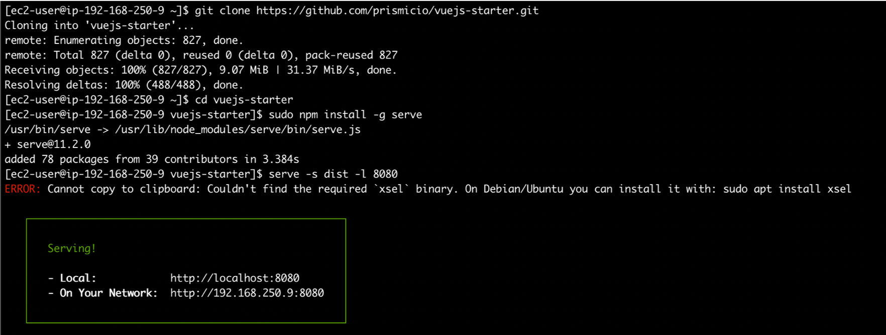
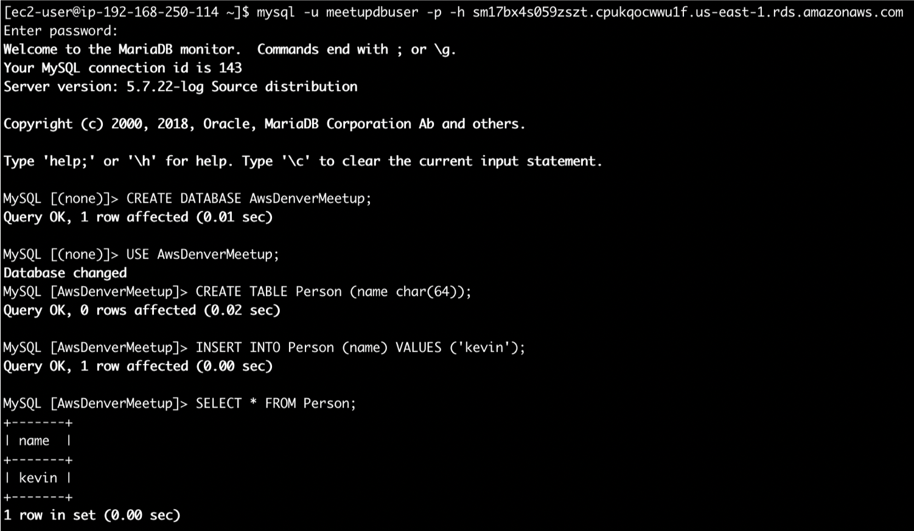

# aws-denver-cloud-formation-meetup
Resources required for AWS Denver IaC Cloud Formation Meetup

## Getting started
 * Clone this repo
 * Create an EC2 Key Pair in AWS console
 * Create a CLoudFormation stack using the provided YAML (You'll need the name of the EC2 Key Pair you just created)

### SSH into EC2 instance and install dependencies
 * `ssh -i ~/.ssh/aws-denver-meetup.pem ec2-user@<EC2 Dns Name>`
 * `sudo yum install mysql git`
 * `curl -sL https://rpm.nodesource.com/setup_10.x | sudo bash -`
 * `sudo yum install nodejs`

SSH to EC2:

Install MySQL and Git:

Install Node.js:

 
### Clone and start the Vue.js starter site
 * `git clone https://github.com/prismicio/vuejs-starter.git`
 * `cd vuejs-starter`
 * `sudo npm install`
 * `npm run build`
 * `serve -s dist -l 8080`
 * From a browser on your box, navigate to: `http://<EC2 DNS NAme>:8080`
    * e.g. `http://ec2-18-206-159-5.compute-1.amazonaws.com:8080`

Launch the site:

### Connect to MySQL and create/query data:
 * Connect to your MySQL DB: `mysql -u meetupdbuser -p -h <RDS DB DNS Name>` 
    * e.g. `mysql -u meetupdbuser -p -h km1g63yabjjupc8.cpukqocwwu1f.us-east-1.rds.amazonaws.com`
 * Enter the password you used when creating the stack
 * `CREATE DATABASE AwsDenverMeetup;`
 * `USE AwsDenverMeetup;`
 * `CREATE TABLE Person (name char(64));`
 * `INSERT INTO Person (name) VALUES ('kevin');`
 * `SELECT * FROM Person;`

Insert/Query SQL:

